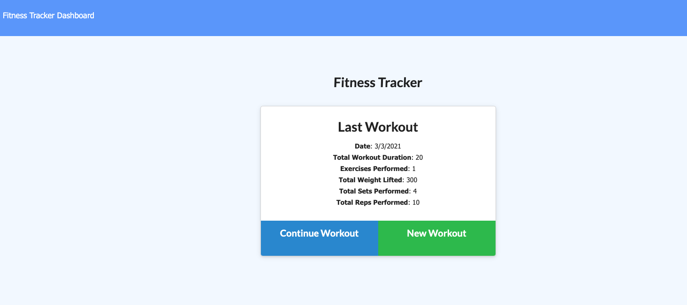

# Workout Tracker

In this website is a  workout tracker. This website will require you to create Mongo database with a Mongoose schema and handle routes with Express.

## User Information 

In this website you can create and track daily workouts.  You are able to log multiple exercises in a workout on a given day. You are able to track the name, type, weight, sets, reps, and duration of exercise. If the exercise is a cardio exercise, you should be able to track my distance traveled.

## Business Context

A consumer will reach their fitness goals more quickly when they track their workout progress.

## Criteria

When the user loads the page, they should be given the option to create a new workout or continue with their last workout.

The user should be able to:

  * Add exercises to the most recent workout plan.

  * Add new exercises to a new workout plan.

  * View the combined weight of multiple exercises from the past seven workouts on the `stats` page.

  * View the total duration of each workout from the past seven workouts on the `stats` page.

## Instructions:
To run the code you have to run npm i.
Then, run npm i seed
to take in the data and setup the database with a few information in it.  

* The URL to the deployed application: https://intense-bastion-93569.herokuapp.com/?id=60428f9def66c50015e2f098

Check out the [MongoDB documentation on the $addFields](https://docs.mongodb.com/manual/reference/operator/aggregation/addFields/), the [MongoDB documentation on the $sum operator](https://docs.mongodb.com/manual/reference/operator/aggregation/sum/), and the [Mongoose documentation on aggregate functions](https://mongoosejs.com/docs/api.html#aggregate_Aggregate) to learn how it can be accomplished.

This is created with HTML, Bootstrap, Nodejs, MongoDB, Express, and Javascript

## License
The MIT License (MIT)

Copyright (c) 2015 Jane Sferrazza

Permission is hereby granted, free of charge, to any person obtaining a copy of this software and associated documentation files (the "Software"), to deal in the Software without restriction, including without limitation the rights to use, copy, modify, merge, publish, distribute, sublicense, and/or sell copies of the Software, and to permit persons to whom the Software is furnished to do so, subject to the following conditions:

The above copyright notice and this permission notice shall be included in all copies or substantial portions of the Software.

THE SOFTWARE IS PROVIDED "AS IS", WITHOUT WARRANTY OF ANY KIND, EXPRESS OR IMPLIED, INCLUDING BUT NOT LIMITED TO THE WARRANTIES OF MERCHANTABILITY, FITNESS FOR A PARTICULAR PURPOSE AND NONINFRINGEMENT. IN NO EVENT SHALL THE AUTHORS OR COPYRIGHT HOLDERS BE LIABLE FOR ANY CLAIM, DAMAGES OR OTHER LIABILITY, WHETHER IN AN ACTION OF CONTRACT, TORT OR OTHERWISE, ARISING FROM, OUT OF OR IN CONNECTION WITH THE SOFTWARE OR THE USE OR OTHER DEALINGS IN THE SOFTWARE.

